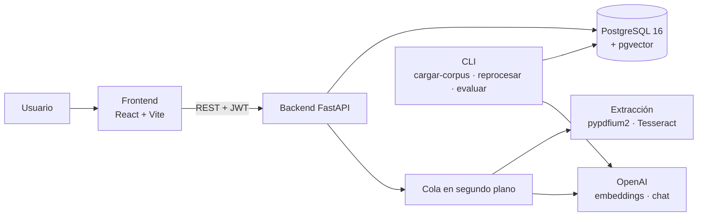
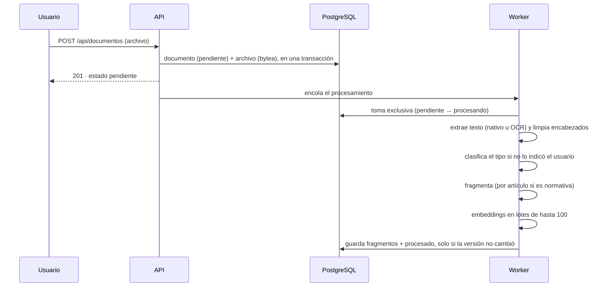

# 03 · Arquitectura

## Vista general

| Componente | Tecnología | Dónde corre |
|---|---|---|
| Frontend | React 19, TypeScript strict, Vite, Tailwind v4, react-router v7 | Vercel (planificado) · `localhost:5173` |
| Backend | Python 3.13, FastAPI, Pydantic v2, psycopg 3 async | Railway (planificado) · Docker local `:8000` |
| Base de datos | PostgreSQL 16 + pgvector | Railway (planificado) · Docker local `:15432` |
| Extracción | pypdfium2 (texto nativo y rasterizado), Tesseract 5 (`spa`, `eng`) | Dentro de la imagen del backend |
| IA | OpenAI: `text-embedding-3-small` (1536 dim.) y `gpt-4o-mini` | API externa |

## Backend en 4 capas

| Capa | Contiene | Regla |
|---|---|---|
| `api` | routers, dependencias, seguridad, manejo de errores | sin lógica de negocio ni SQL |
| `application` | services, validadores, funciones puras (chunking, fusión, métricas) | sin SQL ni FastAPI |
| `core` | DTOs, interfaces (`Protocol`), settings, excepciones | sin I/O |
| `infrastructure` | repositorios (SQL a mano), clientes de OpenAI y Tesseract | sin lógica de negocio |
| `cli` | comandos de operación | como `api`: arma dependencias y llama a services |

`import-linter` valida estas dependencias en cada build: si una capa importa algo que no debe,
el CI falla. El detalle está en `.claude/rules/backend-arquitectura.md`.

## Flujo de un documento

- **Toma exclusiva:** un documento pasa a `procesando` solo si nadie lo tiene. Si el worker de la
  API y el CLI `reprocesar` lo intentan a la vez, uno de los dos lo omite.
- **Versión de procesamiento:** cada `PATCH` que cambia el tipo y cada `reprocesar` suben la
  versión. Un procesamiento que arrancó con una versión vieja descarta su resultado en vez de
  pisar el nuevo.
- **Recuperación:** al arrancar, la API devuelve los documentos trabados en `procesando` a
  `pendiente` y los vuelve a encolar. Si tenían la clasificación pendiente, se clasifican igual,
  porque esa intención está guardada en la base.

## Flujo de una consulta

1. Se genera el embedding de la pregunta.
2. **Dos búsquedas en paralelo** (20 candidatos cada una):
   - **semántica:** distancia coseno con índice HNSW;
   - **por palabras clave:** texto completo en español con índice GIN. Busca con **O**: alcanza
     con que un fragmento contenga una de las palabras, y los que contienen más quedan primero.
3. Se descartan los candidatos solo semánticos que no llegan a la similitud mínima (0,2).
4. Se fusionan con **Reciprocal Rank Fusion** y se toman los 8 mejores.
5. Si no queda ninguno, se responde "No encontré información relevante" **sin llamar al modelo**.
6. Si no, cada fragmento va al modelo con su encabezado: `[n] CAUCA IV, Art. 94 (pág. 24)`. El
   prompt de sistema obliga a citar "Art. N de la norma [n]" y a no usar nada fuera de los
   fragmentos.

## Modelo de datos (schema `ocr_rag`)

| Tabla | Qué guarda | Claves |
|---|---|---|
| `ocr_usuario`, `ocr_rol`, `ocr_permiso`, `ocr_usuario_rol`, `ocr_rol_permiso` | Identidad y permisos | — |
| `ocr_refresh_token` | Refresh tokens, **solo el hash** SHA-256 | `token_hash` único |
| `ocr_documento` | Metadatos: nombre, estado, tipo, norma, páginas, URL de origen, versión de procesamiento, clasificación pendiente | índice por tipo |
| `ocr_documento_archivo` | El archivo original (`bytea`), tipo, tamaño, SHA-256 | índice por SHA-256 (evita duplicados) |
| `ocr_documento_chunk` | Fragmentos: texto, página, artículo, `embedding vector(1536)`, `contenido_tsv` (texto completo en español, generado) | HNSW sobre `embedding`, GIN sobre `contenido_tsv` |

Los scripts que crean todo esto están en `backend/db/`, del 001 al 011, y **los ejecuta una
persona**, nunca la aplicación. El orden está en [05 · Operación](05-operacion.md#scripts-sql).

## API

Todas las respuestas usan el mismo envoltorio en camelCase:
`{ status, message, data, errors, meta }`.

| Método y ruta | Permiso | Qué hace |
|---|---|---|
| `GET /health` | público | Estado del servicio y de la base |
| `POST /api/auth/login` · `/refresh` · `/logout` | público | Sesión |
| `GET /api/me` | autenticado | Usuario, roles y permisos |
| `POST /api/documentos` | `DOCUMENTOS_CARGAR` | Carga multipart: `archivo`, `idioma?`, `tipoDocumento?` |
| `GET /api/documentos?limite&offset` | `DOCUMENTOS_VER` | Listado paginado (`meta.total`) |
| `GET /api/documentos/{id}` | `DOCUMENTOS_VER` | Detalle |
| `PATCH /api/documentos/{id}` | `DOCUMENTOS_CARGAR` | Corrige tipo o norma (`norma: null` la quita) |
| `POST /api/consultas` | `CONSULTAS_REALIZAR` | `{ pregunta, documentoIds?, tiposDocumento?, topK? }` → respuesta y fuentes |

## Frontend

- `api/`: cliente HTTP con un interceptor de refresh. Si llegan varios 401 a la vez, dispara un
  solo refresh.
- `services/` y `hooks/`: un service por recurso; `useAsyncResource` para cargar datos.
- `context/`: `AuthContext` (tokens) y `UserContext` (permisos, siempre desde `/api/me`, nunca
  desde el JWT).
- `pages/`: Inicio, Documentos (carga, tabla con estado en vivo, edición) y Consultas (filtros,
  respuesta y fuentes con norma, artículo y página).

## Seguridad

- Secretos (DSN, clave JWT, API key de OpenAI) solo en variables de entorno, tipados como
  `SecretStr`. Nunca en el repo ni en logs.
- SQL siempre parametrizado; sin ORM.
- Descargas del corpus: solo HTTPS, también después de redirecciones, con límite de tamaño y
  verificación de que el contenido sea PDF.
- Contraseñas con bcrypt (costo 12). El login responde lo mismo si el usuario no existe, si está
  inactivo o si la contraseña es incorrecta, y tarda lo mismo en los tres casos.
